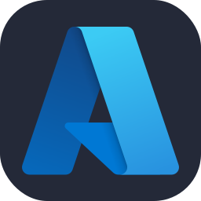

Welcome to my GitHub Page.
I'm Vedant, a DevOps Engineer particularly focusing on Azure, Terraform, and cloud automation. I enjoy making complex tech stuff easier, automating processes, and tweaking systems for better performance

In my journey, I’ve had the opportunity to work on large-scale cloud deployments, design resilient systems, and collaborate with cross-functional teams to deliver seamless operations.

Thanks for visiting and I'd love to [connect](https://www.linkedin.com/in/vedant-shukla-1a036a314/)!

## My favorite tools and technologies ⚙️

Here are some tools and technologies that I have worked with and am interested in:

-  Azure
-  AWS
-  GCP
-  Terraform
-  Python
-  Docker
-  Kubernetes
-  Nginx
-  Git
-  GitHub
-  Prometheus
-  Grafana
